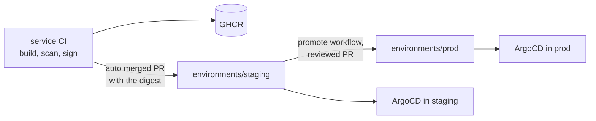
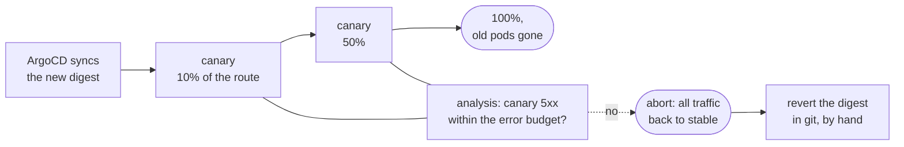
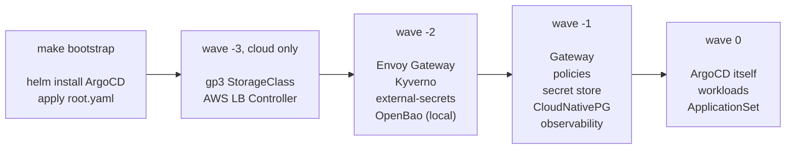
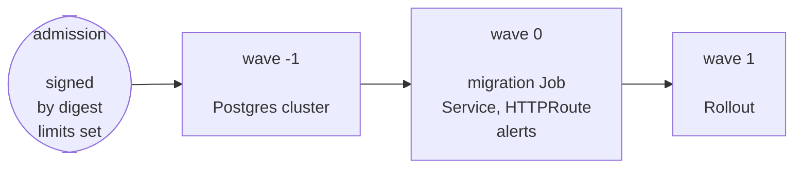
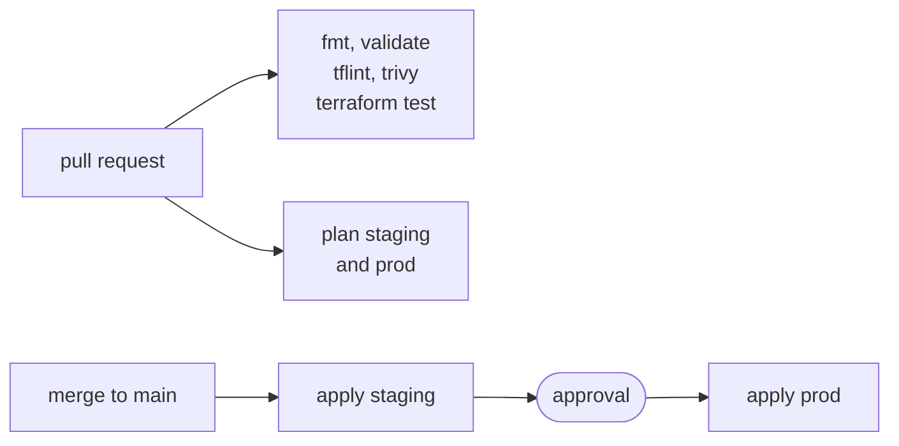
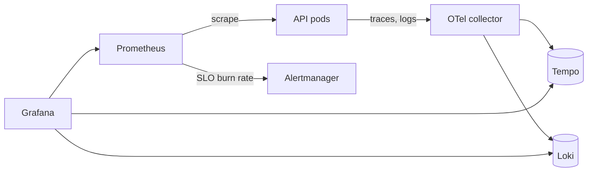

# platform-delivery

The platform side of a delivery flow: everything a service passes through
between a merged commit and a running pod. The service itself lives in
[platform-sample-backend](https://github.com/rootsher/platform-sample-backend).

**Local is smaller, not looser.** The kind cluster runs the same GitOps flow,
database operator and policies as the cloud. Fewer replicas, not fewer rules.

## Release



The image digest is the only thing that moves between environments. A
rollback is a revert of the commit that changed it
([ADR 8](docs/adr/0008-rollback-by-digest.md)).

In the cluster a new digest is released as a canary
([ADR 14](docs/adr/0014-canary-releases.md)):



[Release drill](docs/runbooks/release-drill.md) shows a bad release being
stopped on the local cluster.

## Cluster bootstrap



Each wave waits for the previous one to be healthy.

## Workload



## Infrastructure



GitHub OIDC, no AWS keys in secrets ([ADR 13](docs/adr/0013-applying-terraform.md)).

## Telemetry



Every alert links its runbook in [docs/runbooks](docs/runbooks).

## Running it

Locally, with Docker, kind, kubectl, helm, yq and jq, and about 10 GB of memory:

```sh
make up        # kind cluster, ArgoCD, everything else through GitOps, smoke test
make password  # ArgoCD admin password
make down
```

Then http://notes.localhost:8080/api/notes, http://argocd.localhost:8080 and
http://grafana.localhost:8080. ArgoCD reads from GitHub, so push before you
expect a change. While the repo is private: `make up REPO_TOKEN=$(gh auth token)`.

A new cloud environment, with admin credentials for its account:

```sh
scripts/bootstrap-state.sh staging         # state bucket and key
terraform -chdir=infra/aws/stack init -backend-config=env/staging.s3.tfbackend
terraform -chdir=infra/aws/stack apply -var-file=env/staging.tfvars
# copy the outputs into clusters/staging/platform.yaml, merge
make bootstrap ENV=staging                 # checks the outputs, installs ArgoCD
```

After the first apply, Terraform changes go through the `infra` workflow.

Promotion needs a GitHub App with read and write access to contents and pull
requests, installed on this repository. In this repository and in
platform-sample-backend, `PROMOTION_APP_ID` is an Actions variable,
`PROMOTION_APP_KEY` a secret, and `WORKFLOWS_ENABLED=true` a variable that
switches the workflows on. Here, auto merge is allowed and a ruleset on
`main` requires the `check` job, which is what the staging pull request
waits for before it merges.

## Stack

| Layer | Tool |
| --- | --- |
| Local cluster | kind, Kubernetes 1.37, one control plane and two workers |
| Packaging | Helm, one chart per workload, environments only supply values |
| GitOps | ArgoCD with ApplicationSet, app of apps from `clusters/<env>/root.yaml` |
| Releases | Argo Rollouts, canary on the HTTPRoute, analysis on Prometheus |
| Database | CloudNativePG, Postgres 18, two instances per workload |
| Migrations | a Job from the release image, between the database and the pods |
| Traffic | Gateway API, Envoy Gateway |
| Secrets | external-secrets; OpenBao locally, AWS Secrets Manager in the cloud |
| Admission | Pod Security restricted, Kyverno: signatures, SBOM, registries, digests, limits |
| Supply chain | cosign keyless, Rekor |
| Promotion | GitHub Actions and a GitHub App |
| Checks | kubeconform, Kyverno CLI, promtool, parity check |
| Dependencies | Renovate |
| Runtime scanning | Grype, nightly, over every deployed digest |
| Observability | kube-prometheus-stack, Loki, Tempo, OpenTelemetry collector, Grafana |
| Cloud | EKS on Bottlerocket, NLB, Route 53, KMS, Pod Identity |
| Infrastructure | Terraform, tflint, trivy, `terraform test`, GitHub OIDC |

## Layout

```
bootstrap/       what has to exist before ArgoCD can manage the rest
charts/          workload charts, and platform-apps with one cluster's Applications
clusters/        per cluster: root app, its values, what differs from others
environments/    per environment: workload values only
platform/        manifests shared by every cluster
infra/aws/       Terraform: one root module, one variables file per environment
scripts/         checks, smoke test, bootstrap helpers
docs/            decisions and runbooks
```

## Decisions

1. [Record decisions](docs/adr/0001-record-decisions.md)
2. [Local is smaller, not looser](docs/adr/0002-local-is-smaller-not-looser.md)
3. [GitOps with ArgoCD and one ApplicationSet](docs/adr/0003-gitops-with-argocd.md)
4. [CloudNativePG in every environment](docs/adr/0004-cloudnativepg-everywhere.md)
5. [Gateway API for traffic](docs/adr/0005-gateway-api.md)
6. [external-secrets in every environment](docs/adr/0006-external-secrets.md)
7. [AWS in Terraform](docs/adr/0007-aws-in-terraform.md)
8. [Rollback is a digest revert](docs/adr/0008-rollback-by-digest.md)
9. [Admission policies](docs/adr/0009-admission-policies.md)
10. [Promotion by pull request](docs/adr/0010-promotion.md)
11. [One Terraform root, environments as variables](docs/adr/0011-terraform-layout.md)
12. [Observability and alerting on SLOs](docs/adr/0012-observability.md)
13. [Terraform is applied by CI, prod after a review](docs/adr/0013-applying-terraform.md)
14. [Canary releases with Argo Rollouts](docs/adr/0014-canary-releases.md)
