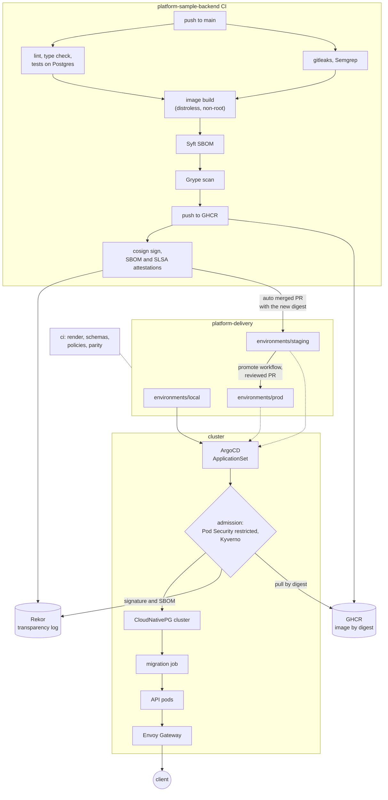
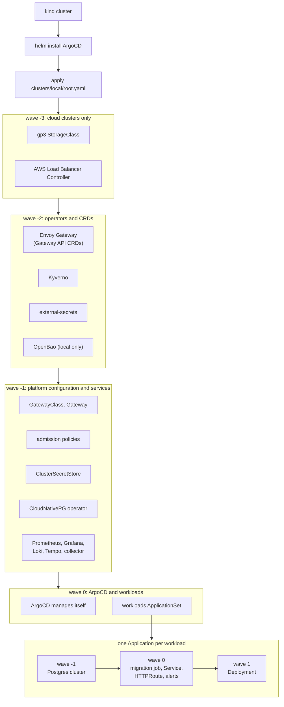
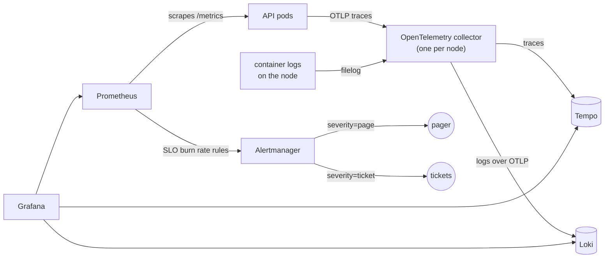

# platform-delivery

The platform side of a delivery flow: everything a service passes through
between a merged commit and a running pod, with no application code in it.
The service it delivers lives in
[platform-sample-backend](https://github.com/rootsher/platform-sample-backend).

**Local is smaller, not looser.** The kind cluster on a laptop runs the same
GitOps flow, the same database operator and the same policies as the cloud
environments. It has fewer replicas and less memory. It does not have fewer
rules.

## Flow

From a push in the service repo to a request served in a cluster. Dashed
lines lead to the staging and prod clusters, which are defined here but not
provisioned (ADR 7); locally the same flow runs end to end.



The digest is the only thing that moves between environments. It is written
once by CI, checked at admission against the signature CI made, and a rollback
is a revert of the commit that changed it ([ADR 8](docs/adr/0008-rollback-by-digest.md)).

### Inside a cluster

`make up` does the first two steps by hand. Everything after that is ArgoCD
syncing this repo, in waves, each one waiting for the previous one to be
healthy.



## Stack

| Layer | Tool | Role |
| --- | --- | --- |
| Local cluster | kind, Kubernetes 1.37 | one control plane and two workers, so spreading and failover are real |
| Packaging | Helm | one chart per workload; environments only supply values |
| GitOps | ArgoCD with ApplicationSet | app of apps from `clusters/<env>/root.yaml`; ArgoCD also manages itself |
| Database | CloudNativePG, Postgres 18 | a two instance cluster per workload; the operator writes the credentials Secret |
| Migrations | a Job from the release image | runs between the database and the new pods, from the same digest |
| Traffic | Gateway API, Envoy Gateway | the platform owns the Gateway, workloads own their HTTPRoutes |
| Secrets | external-secrets, OpenBao locally | Kubernetes auth into OpenBao; AWS Secrets Manager through Pod Identity in the cloud |
| Pod security | Pod Security Admission | restricted level on every workload namespace |
| Admission policies | Kyverno, CEL policy types | signed images, SBOM attestation, known registries, digests, requests and limits |
| Supply chain | cosign keyless, Rekor | signatures and attestations made in CI, verified again at admission |
| Promotion | GitHub Actions, a GitHub App | staging follows main by auto merged PRs; prod by a reviewed PR |
| Checks | kubeconform, Kyverno CLI, yq | every environment rendered and checked on every PR, plus a parity check |
| Dependencies | Renovate | charts, pinned images, actions and CI tools; platform changes are always reviewed |
| Runtime scanning | Grype, nightly | every digest deployed anywhere is rescanned; findings open an issue |
| Metrics and alerts | kube-prometheus-stack | ServiceMonitor and SLO burn rate rules shipped in the workload chart, tested with promtool |
| Traces and logs | OpenTelemetry collector, Tempo, Loki | one collector per node for traces and container logs; S3 in the cloud |
| Dashboards | Grafana | SLO dashboard from git, log to trace links |
| Cloud | EKS, AWS Secrets Manager, NLB | staging and prod as definitions: gp3 storage, TLS from Secrets Manager, HTTPS only |
| Infrastructure | Terraform, tflint, trivy | VPC, EKS on Bottlerocket, KMS, Pod Identity roles, Route 53; tested with a mocked provider |

### Telemetry



Every alert carries a link to its runbook in [docs/runbooks](docs/runbooks).

## Layout

```
bootstrap/       what has to exist before ArgoCD can manage the rest
charts/          Helm charts: the workloads, and platform-apps with one cluster's Applications
clusters/        per cluster: root app, its values, and what differs from others
environments/    one directory per environment, only values live here
platform/        manifests shared by every cluster (gateway, policies, dashboards)
scripts/         the smoke test and the checks CI runs
infra/aws/       Terraform: one root module, one variables file per environment
docs/adr/        decisions and the reasons behind them
docs/runbooks/   what to do when an alert fires
```

An environment is a directory. Adding one means adding values, not templates.

## Running it locally

Needs Docker, kind, kubectl, helm and jq, and about 10 GB of free memory.

```sh
make up        # cluster, ArgoCD, then everything else through GitOps
make password  # admin password for the ArgoCD UI
make down
```

`make up` only installs ArgoCD and applies `clusters/local/root.yaml`. From
there ArgoCD takes over managing itself, installs the operators and syncs the
workloads from `environments/local`. The last step is a smoke test that writes
a note through the Gateway and reads it back.

Once it is up, http://notes.localhost:8080/api/notes is the service,
http://argocd.localhost:8080 is ArgoCD and http://grafana.localhost:8080 is
Grafana (the admin password is in the `grafana-admin` Secret in `monitoring`).

ArgoCD reads this repo from GitHub, not from the working copy, so local changes
have to be pushed before the cluster sees them. While the repo is private, pass
a token that can read it: `make up REPO_TOKEN=$(gh auth token)`.

## Decisions

The reasoning is in [docs/adr](docs/adr). The short version:

- ArgoCD with a single ApplicationSet, environments as directories.
- CloudNativePG in every environment, including local.
- Gateway API for traffic.
- external-secrets everywhere, with a different store per environment.
- AWS is described in Terraform and checked without an account. Nothing is
  actually provisioned; the working end to end flow is the local one.
- Schema changes are expand then contract, so a rollback is a digest revert.
- Pod Security Admission at restricted plus Kyverno in Enforce mode in every
  environment and every namespace outside the platform's own: signed images
  by digest, known registries, requests and limits.
- Staging follows main through automatic pull requests; prod gets the digest
  staging already runs, through a reviewed pull request.
